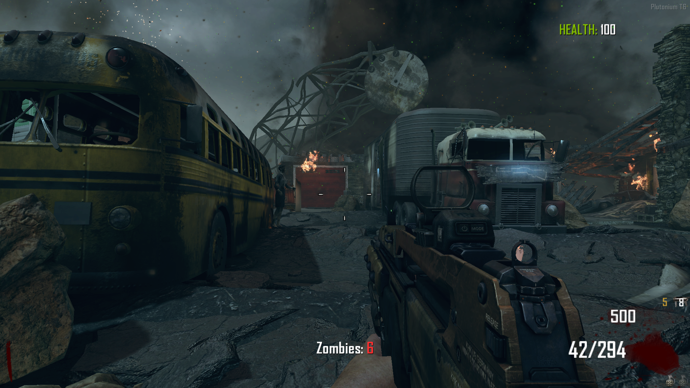

# Black Ops 2: Plutonium GSC Script Modding :scroll:

Be sure to install every [prerequisites](./SETUP.md) in order to finish the workshop.

In this workshop, you will:

- Use a scripting language
- Use C / C++ derivative languages
- Multi-threading language

## What is Plutonium?

Plutonium is a collaborative project aiming to revive *Call of Duty* games.

Plutonium already revived *Call of Duty: World at War*, *Call of Duty: Black Ops 2* and *Call of Duty: Modern Warfare 3*. The first two ones are divided in 2 parts:

- Multiplayer
- Zombies

## Ok now... What is GSC?

GSC is the language used by Activision developing studios: Infinite Ward, Treyarch, Raven Studios, Sledgehammer studios...

It is a compiled programming language and a C / C++ derived language using a lot... I mean a lot of threads. Almost based on threads.

Unfortunalty, there's little documentation for this langage. In this repository, you'll find a list of functions you can use to go through the workshop.

## And how can I compile my scripts if it's a compiled language?

Good question! In this repository, you'll find a GSC Compiler folder inside the "GSC Compiler" folder. Inside this folder, you'll find a Compiler.exe file.

While being on Windows, you can drag and drop the script file into the compiler. A file `nameofyourscript-compiled.gsc` will be created just near your script file.

Finally, you just have to drag and drop your compiled file into the following folder: `C:\Users\$user\AppData\Local\Plutonium\storage\t6\scripts\zm`.

## Step 1: Bases of GSC Scripting

No knowledge with GSC? No worries, we'll go through. You first decide to create a script just saying `Hello world!` when your player connects to the game.

Your script will have to:

- When you connect to your custom game, the game shows a text saying `Hello world!`.

If you need any help, you can use the little [documentation file](./DOC.md) or you can check this [link](https://plutonium.pw/docs/modding/loading-mods/) given by Plutonium Staff.

To validate your script, you can check if your game displays this when launching a game:

## Step 2: Create a Zombie Counter

Ok, you welcomed the joining player. Now in order to estimate when the round will end, we can add a zombie counter.

The counter will be updated each seconds. You will have to:

- Display a text on bottom center of the screen
- Display the number of zombies on the map

You can use functions createServerFontString, setPoint, get_round_enemy_array and setValue functions.

Good luck! :wink:

If you finish it early, you can display your player's current health on screen using the same functions as the counter.

To validate your script, you can check if your game displays this when launching a game:

Bonus script validation:

## Step 3: Give your player a weapon

Ok now we are quite comfortable. At the moment, our player spawns with only an unpacked M1911 pistol.

M1911 is a really bad weapon but it's like zombie DNA! We can't leave it so we're going to give our weapon a weapon available everywhere (yes there's map exclusives weapons).

So in order to protect our player, we're going to give him one of the best multiplayer weapons of all time: the DSR-50. And not the unpacked DSR-50, we're going to give him a Iron Sights Silenced DSR-50, the most rare packed weapon of the game.

You can check the [weapons.md](./weapons.md) file referencing every weapons and attachments.

To check what attachment you can attach to what weapon, you can check out the wiki by search 'weapon name + bo2'. You might find callofduty.fandom.com/wiki.

If you finish it early, you can change your player start weapon. You can validate it when your player spawn with the weapon you gave him in hand without touching anything.

To validate your script, you can check if your game displays this when launching a game:

Bonus script validation:

## Step 4: Give your player a specific weapon depending on the map

Oh my Galil, wonderful creature! But there's more wonderful than the Silenced Packed Galil like the Blundergat, the Krauss Refibrillator, the Petrifier, the Boomhilda, the Sliquifier and the... Thrustodyne Aeronautics Model 23. So many wonder weapons but only on certain maps... :sob:

***Warning! Be careful when manipulating upgraded weapons! Some upgraded weapons have attachments but when rendering them with Plutonium, attachments aren't added to weapons. If you need / want to add them, you need to add them manually just as previous exercise.***

So now, your job is to help your player to fix his weapon envy problems.

The current map name is located in Dvars. I just let you search for it! :wink:

To validate your script, you can check if your game displays this when launching a game:

Packed (Upgraded) Mtar with MMS and Grenade Launcher:

Packed (Upgraded) HAMR with ACOG Sight and Foregrip:

Packed (Upgraded) Galil with Reflex dot sights:

Packed (Upgraded) M8A1 with Reflex dot Sights and Grenade Launcher:

Packed (Upgraded) Blundergat (Mob of the Dead Exclusive):

Packed (Upgraded) Sliquifier (Die Rise Exclusive):

Packed (Upgraded) AN94 with MMS and Foregrip (Buried Exclusive):

Packed (Upgraded) Mauser C96 (Origins Exclusive):

Packed (Upgraded) MG08/15 (Origins Exclusive):

## Step 5: Give your player a perk

Now that your player has the weapon of its dreams wherever he goes, you will give your player a perk. There's a lot of perk:

- Quick Revive
- Juggernog
- Speed Cola
- Stamina
- Double Tap Root Beer I commonly called Double Tap I
- Double Tap Root Beer II commonly called Double Tap II (best version of Double Tap)
- Mule Kick
- Deadshot Daiquiri
- Tombstone Soda (only on Tranzit Maps)
- Who's who (only on Die Rise)
- Electric Cherry (only on Mob Of The Dead)
- Vulture Aid Elixir (only on Buried)
- PhD Flopper (only on Origins)

With this whole list, we'll be able to add multiple perks. So why limit our player? If it can become Superman why not? Let's let him have 9 perks at the same time.

Your script must:

- Let your player have 9 perks (you will find each 9 perks ids from the [perk file](./perks.md))
- Check if your player already have the perk
- Check if the perk has been deactivated
- Be removed if the player goes down, dies or if the `Who's who` perk is triggered
- Make your player burp when he finishes to drink the perk

By checking the Plutonium T6 Forums, you will be able to find what you need.

As a bonus, you can make the script once again responsive depending on the map you're playing on.

To validate your script, you can check if your game displays this when launching a game:

Example on Origins, only map with 9 perks:

## :tada: Congratulations !

You've now finished the workshop! Congrats! You are now able to make a tiny map-responsive GSC script.

There's a lot more you can learn using GSC.

## To go further

If you want to learn more about creating scripts and / or collaborate on Plutonium, you can check those links:

- [Plutonium Forums](https://forum.plutonium.pw/) - There's a lot of code here and you can discuss with every developer on Plutonium
- [JezuzLizard Github](https://github.com/JezuzLizard) - Plutonium Staff Lead
- [DoktorSAS Github Scripts Repository](https://github.com/DoktorSAS/GSC) - Repository containing Scripts for Plutonium T6 and IW5

## Authors

| [ Arthur ADAM](https://github.com/0Nom4D) |
| :---: |
